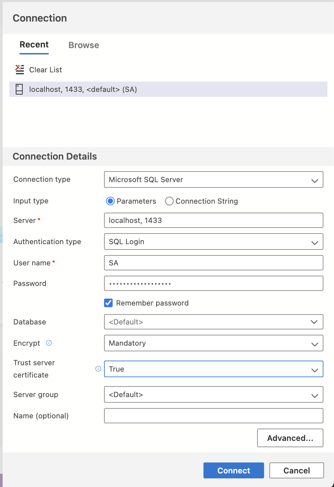

# WebAPI

In order to [create a Web API with ASP.NET Core](https://learn.microsoft.com/en-us/aspnet/core/tutorials/first-web-api?view=aspnetcore-8.0&tabs=visual-studio-code) in **VS Code**, we just have to launch the **command palette**, select `.NET: New Project` and select **ASP.NET Core API**. I chose the following settings:

- Authentication type: **none**
- Configure for **HTTPS**
- Use **controllers**
- Enable [Open API](https://www.openapis.org/) support (aka swagger)

## Launching the API

Once the project was generated, after running `dotnet run` we got the [swagger](https://swagger.io/) UI, available at:
```
http://localhost:5028/swagger/index.html
```

We could also see the raw JSON output of the api by visiting:
```
http://localhost:5028/weatherforecast
```

> [!NOTE]
> You can get the last segment of the URL, by checking in the `controllers` folder; there it must be a file named `WeatherForecastController`. The **endpoint** for hitting this controller, it's the controller's name (case insensitive) without the word `Controller`.

## Enabling HTTPS

Even though we created our project with **HTTPS support**, according to the [docs](https://learn.microsoft.com/en-us/aspnet/core/tutorials/first-web-api?view=aspnetcore-8.0&tabs=visual-studio-code), to **enable** serving the content in the HTTPS URL, we have to:

1. Trust the HTTPS development certificate by running the following command:

```
dotnet dev-certs https --trust
```

2. Run the following command to start the app on the https profile:

```
dotnet run --launch-profile https
```

Assuming the app is running at **port 7188**, we can access the endpoint at:

```
https://localhost:7188/weatherforecast
```

And the **swagger** interface at:

```
https://localhost:7188/swagger/index.html
```

## Modifying the API routes

Since we generated our API with controllers, each **URL endpoint** can be found inside each controller. On top of each **controller class**, we can find an [attribute](https://learn.microsoft.com/en-us/dotnet/csharp/advanced-topics/reflection-and-attributes/) that determines the **base URL route**. There we can modify the base route:

- From `[Route("[controller]")]` to `[Route("api/[controller]")]`, so that from now on the endpoint would be at `api/weatherforecast`. 

## Need to install

To get our API going, we're gonna need to install a few things:

- A **Relational Database Management System** (RDBMs), we'll go with SQL Server.
### Database
- A **GUI** to interact with SQL server, in this case [Azure Data Studio](https://azure.microsoft.com/en-us/products/data-studio) ([DataGrip]() is cooler but costs money)

We'll use [SQL Server](https://www.microsoft.com/en-us/sql-server/sql-server-downloads) as our database, the problem is that is only for **Windows**! To address that problem, we'll use Docker:

1. Pull the image:
```
docker pull mcr.microsoft.com/azure-sql-edge
```

2. Initiate the SQL Server Container with the following command:
```
docker run -e "ACCEPT_EULA=1" -e "MSSQL_SA_PASSWORD=1234" -e "MSSQL_PID=Developer" -e "MSSQL_USER=SA" -p 1433:1433 -d --name=sql mcr.microsoft.com/azure-sql-edge
```

If you prefer to use **Docker Compose**, use the following `docker-compose.yml` file:

```yaml
services:
  sql:
    image: mcr.microsoft.com/azure-sql-edge
    container_name: sql
    environment:
      ACCEPT_EULA: "1"
      MSSQL_SA_PASSWORD: "reallyStrongPwd123"
      MSSQL_PID: "Developer"
      MSSQL_USER: "SA"
    ports:
      - "1433:1433"
    restart: always
```

To run it, just execute `docker-compose up -d` in your terminal.

### Azure Data Studio

As a GUI to SQL server we'll use [Azure Data Studio](https://azure.microsoft.com/en-us/products/data-studio). Just download it, and connect to the SQL runnning on Docker. For the settings used in the `docker-compose.yml` above, we'll use the following in **Azure Data Studio**:



### VS Code Extensions

- [C# Extensions - JosKreativ](https://marketplace.visualstudio.com/items?itemName=kreativ-software.csharpextensions)
- [C# Dev Kit](https://marketplace.visualstudio.com/items?itemName=kreativ-software.csharpextensions)

## Creating Models

Models are what we use to interact with the database. They define the structure of the data we'll be pulling of the database. To create a model, we can use the **C# Extensions** (VS Code extension); just create a `Models` folder, **right-click** on it, and select `New C# > Class`, then give it a filename and boom! profit.

## ORM

We need to install some necessary packages using **NuGet Gallery**, so open the **command palette**, then `NuGet: Add NuGet Package`, and search for `sqlserver`

> [!WARNING]
> Choose a version of the package that matches the version of NET you are using (run `dotnet --version` to find out, or check your `WebApi.csproj` file, the property `TargetFramework`, which in my case was `8.0.8`).

The packages we need are:

- `Microsoft.EntityFrameworkCore.SqlServer`, by Microsoft (just search for `sqlserver`).
- `Microsoft.EntityFrameworkCore.Tools`, by Microsoft (just search for `tools`).
- `Microsoft.EntityFrameworkCore.Design`, by Microsoft (just search for `design`).

With the packages above, we'll be able to create our `ApplicationDBContext` class, which is what we'll inject in our controllers to fetch data from our DB as objects (this class inherits from `DbContext`, which is one of the classes included in `EntityFrameworkCore`)

## Creating a Database

In Azure studio, we can create a database with:

```sql
-- Use master database
USE master;
GO

-- Create TutorialDB database if it does not exist
IF NOT EXISTS (SELECT name FROM sys.databases WHERE name = N'finshark')
BEGIN
    CREATE DATABASE [finshark];
END
GO
```

If you refresh your databases, `finshar` should be there.

## Connection String

We have to add a connection string in our `appsettings.Development.json` file:
```json
"ConnectionStrings": {
  "DefaultConnection": "Server=localhost; Database=finshark; User Id=SA; Password=reallyStrongPwd123; TrustServerCertificate=true"
},
```

> [!TIP]
> Check [this site](https://www.connectionstrings.com/sql-server/) for learn about connection strings.

## Migrations

In order to create the **database tables** you need to run 2 commands:

```
dotnet ef migrations add InitialMigration
dotnet ef database update
```

> [!WARNING]
> In order to run the commands above, you need to install the `dotnet-ef` tool, so run `dotnet tool install --global dotnet-ef`.

After the migrations run successfully:

- A new `Migrations` folder will show up in our project.
- Also, if you **refresh** your `finshark` database, you should be able to see the newly created **tables**

## Deleting a Database from Azure Data Studio

When I run the migrations the **1st time** and restarted the app, I received the following warning:

```
warning CS8981: The type name 'init' only contains lower-cased ascii characters. Such names may become reserved for the language.
```

That's because I named my first migration as `dotnet ef migrations add init`. So I decided to **delete** the `Migrations` folder, and the database as well:

```sql
USE master;
GO

ALTER DATABASE finshark SET SINGLE_USER WITH ROLLBACK IMMEDIATE;
GO
DROP DATABASE finshark;
GO
```

Then I ran the migrations again and all was good.

## Controllers

**Web API** controllers should typically derive from [ControllerBase](https://learn.microsoft.com/en-us/dotnet/api/microsoft.aspnetcore.mvc.controllerbase) rather from [Controller](https://learn.microsoft.com/en-us/dotnet/api/microsoft.aspnetcore.mvc.controller):

>[!NOTE]
> `Controller` derives from `ControllerBase` and adds support for **views**, so it's for handling web pages, not web API requests.

### Interacting with a Database

If our **controller** is gonna interact with a **database**, we must [inject](https://learn.microsoft.com/en-us/aspnet/core/fundamentals/dependency-injection?view=aspnetcore-8.0) an **instance** of the [DbContext](https://learn.microsoft.com/en-us/dotnet/api/microsoft.entityframeworkcore.dbcontext?view=efcore-8.0) class. We do that in the **constructor**:

```c#
private readonly ApplicationDBContext _context;

public StockController(ApplicationDBContext context)
{
    _context = context;
}
```

> [!TIP]
> That can also be done in a [primary constructor](https://learn.microsoft.com/en-us/dotnet/csharp/programming-guide/classes-and-structs/instance-constructors#primary-constructors)
>
> ```c#
> public class StockController(ApplicationDBContext context) : ControllerBase
> {
>     // Hold an instance of ApplicationDBContext
>     private readonly ApplicationDBContext _context = context;
>     ...
> }
> ```

### Attribute Routing

[Attribute routing](https://learn.microsoft.com/en-us/aspnet/core/mvc/controllers/routing?view=aspnetcore-8.0#attribute-routing-for-rest-apis) consists on using [C# attributes](https://learn.microsoft.com/en-us/dotnet/csharp/advanced-topics/reflection-and-attributes/) to easily map our [controller actions](https://learn.microsoft.com/en-us/aspnet/mvc/overview/older-versions-1/controllers-and-routing/creating-an-action-cs):

- To **endpoints** in our API (URLs), for example, `[Route("api/books")]`.
- To **HTTP verbs** in our API, for example, `[HttpGet]` or `[HttpPost]`.

Often, the **routes** in a **controller** all start with the same **prefix**, such as `api/books` or `api/users`. In that case we can use the `[RoutePrefix]` attribute, at the **class level**.

> [!TIP]
> Use a tilde (`~`) on the method attribute to override the route prefix at a **method level**.

🦊 Read more about [attribute routing](https://learn.microsoft.com/en-us/aspnet/web-api/overview/web-api-routing-and-actions/attribute-routing-in-web-api-2). 🦊 

### ApiController attribute

The [ApiController attribute](https://learn.microsoft.com/en-us/aspnet/core/web-api/?view=aspnetcore-8.0#apicontroller-attribute) can be applied to a **controller class** to enable the following opinionated, **API-specific** behaviors:

- Attribute routing requirement
- Automatic HTTP 400 responses
- Binding source parameter inference
- Multipart/form-data request inference
- Problem details for error status codes

## Data Transfer Objects (DTOs)

Whenever we retrieve some **entity** from a database, very frequently we want to trim down the information we send down to the user. In order to do that, we can define a [DTO](https://learn.microsoft.com/en-us/aspnet/web-api/overview/data/using-web-api-with-entity-framework/part-5), which is an [object](https://learn.microsoft.com/en-us/dotnet/csharp/fundamentals/object-oriented/objects) that defines how the data will be sent over the network.

> [!NOTE]
> **DTOs**, are **simple objects** that carry data between different layers of an application. Typically contain only **properties** and no behavior (no methods).

For organization, we can create a `DTOs` folder, where we'll place a subfolder for each of our **models**. Inside each subfolder, we can create the **DTO class**.

> [!TIP]
> In [Domain Driven Design](https://en.wikipedia.org/wiki/Domain-driven_design) we have two layers:
>
> - **Domain Layer** (Domain Entities): Contains all the core business logic.
> - **Application Layer** (DTOs): Manages data flow and communication.
>
> DTOs are used for trimming down the **entities** from a data store before sending them to the client.

### Mappers

Mappers facilitate the conversion of data between different representations, such as between **DTOs** and **domain entities**.

1. **Entity to DTO**: When we fetch an entity from the database, the mapper extracts the relevant information and converts it into a simpler DTO before sending it to the **client**.
2. **DTO to Entity**: When we receive a DTO (e.g., from a user input form), the mapper takes that DTO and converts it back into a full entity, before storing it in the **database**.

> [!NOTE]
> In many applications, usually there are 2 levels of **models**: 
> 
> 1. **Domain internal models**, which we defined in the `Models` folder.
> 2. **Public models**, which are often called DTOs (data transfer objects).
> 
> DTOs are the models consumed by a **client**, and usually they are tinier than their domain counterparts. Also, a DTO model may contain properties from few domain models.

## POST: Writing to the Database

Whenever we have to interact with the **database**, we'll be using [Entity Framework](https://learn.microsoft.com/en-us/ef/), by far the most popular **ORM** for [.NET](https://dotnet.microsoft.com/en-us/).

> [!NOTE]
> **Entity Framework** is a modern **object-relation mapper** that lets you build a high-level **data access layer** across a variety of databases, including **SQL Databases** (SQLite, MySQL, PostgreSQL), and **Azure Cosmos DB**. It supports [LINQ](https://learn.microsoft.com/en-us/dotnet/csharp/linq/) queries, change tracking, updates, and schema migrations.

When writing to the database, we need to use a couple of **EF** methods:

- One for tracking the data we want to write: `_context.Movies.Add()`
- Another one for actually saving the **tracked data** to the database: `_context.Movies.SaveChanges()`

## Repository Pattern

So far, our **controller methods** include logic that interacts directly with the **database**, via the **Entity Framework**. But what if in the future we decided to replace **EF** for another **ORM** or even fetch the domain objects from a different **API**.

> [!NOTE]
> The four layers in typical **DDD** implementations are:
> 
> - Domain Layer
> - Application Layer
> - Infrastructure Layer
> - User Interface (Presentation) Layer

The idea behind this pattern is to create some classes to encapsulate the logic that deals with data persistence concerns. That way, our controllers interact with the **domain objects** through objects (**repositories**) of this new **abstraction layer**.

> [!NOTE]
> Using this pattern we won't have to inject the **database context** into the **controller constructors**.

To implement our **repositories** we'll use:

- [C# interfaces](https://learn.microsoft.com/en-us/dotnet/csharp/fundamentals/types/interfaces), which we'll store under a folder named `Interfaces`. Each **interface repository name** will follow the convention:

```
I + repositoryName + Repository
```

For example, our repository for stocks will be called `IStockRepository`, and the one for comments `ICommentRepository`.

- C# classes, which we'll keep under the `Repository` folder.

Once all is done, we need to wire them up in `Program.cs`:

```c#
builder.Services.AddScoped<IStockRepository, StockRepository>();
```

> [!WARNING]
> Remember to **restart** your app after the changes; the `watch` can't handle the heat!

## Handling JSON

For handling JSON in our app, we need to install 2 packages:

- Newtonsoft.Json
- Microsoft.AspNetCore.Mvc.NewtonsoftJson

> We can do that from **NuGet Gallery**.

Then we have to add the following lines to our `Program.cs` file:
```cs
builder.Services.AddControllers()
.AddNewtonJson(options => {
  options.SerializerSettings.ReferenceLoopHandling = ReferenceLoopHandling.Ignore;
});
```

## Data Validation

Add your data validation:

- In the **route attributes**, `[Route("{id:int}")]`. That's enough in `GET` requests for an item with some id.
- For validating data incoming in the *request body**, we'll use the [DataAnotations](https://learn.microsoft.com/en-us/dotnet/api/system.componentmodel.dataannotations?view=net-8.0) namespace.

Data anotations look like:
```cs
[Required]
[MinLength(5, ErrorMessage = "Title must be at least 5 characters long")]
[MaxLength(250, ErrorMessage = "Title must be at most 250 characters long")]
public string Title { get; set; } = string.Empty;
```

You should put them on top of the methods of your DTOs, not the models.

Then we have to add the following lines in our **controller actions**:
```cs
if(!ModelState.IsValid)
  return BadRequest(ModelState);
```

This `ModelState` comes included in the `ControllerBase`.

## Filtering Data

We're writing all our **database access logic** in the `repositories` folder; there we files which contain classes for dealing with our database. In these classes we're injecting our **database context**, and calling methods through it.

> [!NOTE]
> The **database context** has **getter/setter** methods for each of the **agregate roots** or **entities** of our **domain model**.

So far we've been using [LINQ](https://learn.microsoft.com/en-us/dotnet/csharp/linq/) queries to interact with the **Entity Framework** in an **object oriented** way (`ToList`, `FindAsync`, `FirstOrDefaultAsync`, etc). These methods usually return [IEnumerable](https://learn.microsoft.com/en-us/dotnet/api/system.collections.ienumerable?view=net-8.0), which are collections of data.

> [!NOTE]
> These methods generate **SQL**, which is what SQL databases understand.

Sometimes we need to write more elaborated queries to **filter** our data collection, according to some criteria. For these scenarios, we have to use [AsQueryable](https://learn.microsoft.com/en-us/dotnet/api/system.linq.queryable.asqueryable?view=net-8.0) to convert the `IEnumerable` to [IQueryable](https://learn.microsoft.com/en-us/dotnet/api/system.linq.iqueryable?view=net-8.0):

```cs
var stocks = _context.Stocks.AsQueryable();
```

Once we have an `IQueryable`, we can do [lots of stuff](https://learn.microsoft.com/en-us/dotnet/framework/data/adonet/ef/language-reference/supported-and-unsupported-linq-methods-linq-to-entities) with it:

- Filter according to some predicate using [WHERE](https://learn.microsoft.com/en-us/dotnet/api/system.linq.queryable.where?view=net-8.0#system-linq-queryable-where-1(system-linq-iqueryable((-0))-system-linq-expressions-expression((system-func((-0-system-boolean)))))):

```cs
stocks.Where(s => s.Symbol == symbol);
```

- Limit:

```cs
stocks.Limit(3);
```

## Passing the Filter Criteria to the Repository Method

The user-supplied values to filter queries must be passed in the controller, to whatever **repository** method we want to filter, for example:

```cs
var stocks = await _stockRepo.GetAllAsync(query);
```

## Editing our Repository and Repository Interface

Then, we need to modify our repository and its interface, so that the method now accepts the query:


## Query String Helpers

A nice little technique to deal with long query strings, is to create a `QueryObject` class (we can store it in a `Helpers` folder), and add properties to each of the **key/values** of our [query string](https://en.wikipedia.org/wiki/Query_string).